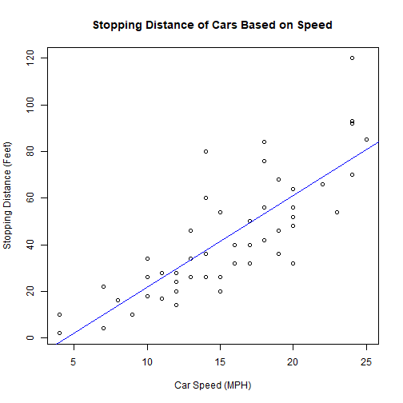

Coursera Project: Shiney Application and Reproducable Pitch
========================================================
author: A Coursera Student
date:  19 July 2020
autosize: true

Project Task
========================================================

This is a presentation deliverable for the course Developing Data Products as part of the Coursera Data Science Specialization.

The presentation sadisfies the following requirements:
- It is done in Rstudio Presenter
- It is 5 pages long
- It is published in Rpubs
- It contains embedded R code

Project Solution
========================================================

Using data provided by "cars" dataset, a linear model was fitted that predicts cars' stopping distance based on its speed.

Application link:
https://mfindrik.shinyapps.io/course_project/

Application code link:
https://github.com/mfindrik/data_product/tree/master/course_project

Dataset Summary
========================================================

A sample and summary of the dataset used in the application:


```
  speed dist
1     4    2
2     4   10
3     7    4
4     7   22
5     8   16
6     9   10
```

```
     speed           dist       
 Min.   : 4.0   Min.   :  2.00  
 1st Qu.:12.0   1st Qu.: 26.00  
 Median :15.0   Median : 36.00  
 Mean   :15.4   Mean   : 42.98  
 3rd Qu.:19.0   3rd Qu.: 56.00  
 Max.   :25.0   Max.   :120.00  
```


Linear Model
========================================================

The application calculates the stopping distance based on linear model obtained by fitting speed and distance variables:


```r
data(cars)
mdl <- lm(cars$dist ~ cars$speed)
```


